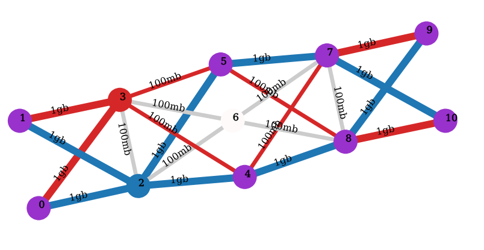

# Conflict-Based Solver (cbs)

This is the code repo for the ICAPS 2022 paper:  [Conflict-Based Search for the Virtual Network Embedding Problem](https://ojs.aaai.org/index.php/ICAPS/article/view/19828) by Yi Zheng, Srivatsan Ravi, Erik Kline, Sven Koenig, T. K. Satish Kumar. 

The code was built based on the ViNE-Yard simulator from IEEE INFOCOM 2009 [Virtual Network Embedding with Coordinated Node and Link Mapping](https://ieeexplore.ieee.org/document/5061987) by N.M.K. Chowdhury, M.R. Rahman, and R. Boutaba.

## Special Note

The authors of the CBS algorithm recieved the base VINE-Yard simulator
code from N.M.K. Chowdhury via email without a license attached.
That code (src/{def.hpp, simulator.cpp, simulator.hpp, utility.cpp,
utility.hpp}) has been removed from this repo in order to assert that the code
in this repo contains only licensed material.

Until the authors can assertain the license of that material, one may ask
the authors of the ViNE-Yard code directly for a copy of their code.

## Dependencies

* c++
* cmake
* make
* libboost

### Debian/Ubuntu

```
sudo apt update
sudo apt install gcc g++ cmake make libboost-all-dev
```

### Development

```
* clang-format
* docker
```

## Building

```
mkdir build
cd build
cmake ..
make
```

## Commiting

Before commiting code, ensure that the code has been clang-formatted.

```
clang-format -style=file --dry-run --Werror src/*.hpp src/*.cpp
```

## Running

We've provided one substrate network file `sub.txt` and example VNRs in the
`examples` directory.  Below is an example:

```
./build/cbs examples/req0.vnr examples/sn_cbs.in out/
```

Inputs:

> 1: Virtual Network Request file
> 2: Substrate Network Graph file
> 3: Directory to place output


### Substrate Network format

> First line: number of nodes, number of edges.
> Then for each node line: <node_loc_x>, <noc_loc_y>, <CPU_capacity>
> Then for each edge line: <from>, <to>, <bandwidth>, <delay> (not used)

The following is an example of 11 node, 22 edge topology.

We've formulated the SN with the notion that traffic originates at `0,1` coords
(1,1 and 2,2) and sinks at `10,11` (3,3 and 4,4).

Each link is then set with either 100Mb or 1Gb connections.

```
11 22
1 1 50
2 2 50
0 0 10
0 0 10
0 0 10
0 0 10
0 0 10
0 0 10
0 0 10
3 3 100
4 4 100
0 2 1000000000.0 0
0 3 1000000000.0 0
1 2 1000000000.0 0
1 3 1000000000.0 0
2 3 100000000.0 0
2 4 1000000000.0 0
2 5 1000000000.0 0
2 6 100000000.0 0
3 4 100000000.0 0
3 5 100000000.0 0
3 6 100000000.0 0
4 7 100000000.0 0
4 8 1000000000.0 0
5 7 1000000000.0 0
5 8 100000000.0 0
6 7 100000000.0 0
6 8 100000000.0 0
7 8 100000000.0 0
7 9 1000000000.0 0
7 10 1000000000.0 0
8 9 1000000000.0 0
8 10 1000000000.0 0
```

Visualized it looks like the image below.
The red and blue lines indicating multiple VNR allocations taking place
across multiple paths.



### Virtual Network Request format

> First line: <num_node>, <num_edge>, <split_or_not> (not used),
> <arrive_timestep>, <VNR_duration>, <topology_num> (not used), <max_distance>
> Then node lines: <node_loc_x>, <noc_loc_y>, <CPU>
> Then edge lines: <from>, <to>, <bandwidth>, <delay> (not used)

Here is one such VNR using the SN from the above example- embedding as the path
from node 1 to node 10.

```
2 3 0 0 10 0 0
1 1 50
3 3 100
0 1 100000000.0 0
```

### Output file format

First line: the command line used to generate the results.
Then each line: <VNR_id>, <arrive_or_depart_timestep>, <VNR_duration>,
<arrive_or_depart>, <accepted_or_not>, <total_revenue>, <total_cost>,
<num_CBS_nodes>, <runtime_seconds>.

## Building the container

```
sudo ./build_container.sh
```

## Acknowledgements

This research is supported by DARPA under grant number HR001120C0157 and NSF
grants: 1409987, 1724392, 1817189, 1837779, 1935712, 2112533, 2121028. The
views, opinions, and/or findings expressed are those of the author(s) and should
not be interpreted as representing the official views or policies of the
sponsoring organizations, agencies, or the U.S. Government.

## License

The 3-Clause BSD License
